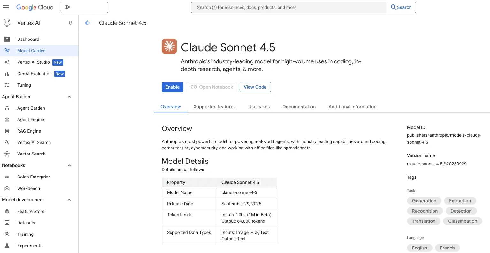
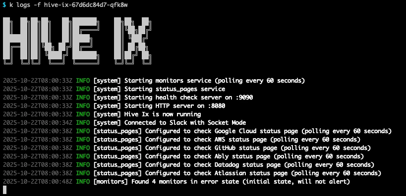

+++
author = "davidcalvert"
title = "Building an agentic Slackbot with Claude Code"
date = "2025-10-30"
description = "Building an agentic Slackbot with Claude Code"
tags = [
    "AI", "Slackbot", "Claude Code", "GCP", "Vertex AI"
]
categories = [
    "tech"
]
canonicalUrl = "https://medium.com/@dotdc/building-an-agentic-slackbot-with-claude-code-eba0e472d8f4"
thumbnail = "/img/thumbs/ix.webp"
featureImage = "ix-banner.webp"
featureImageAlt = 'The Hive Ix banner!'
+++

> This article was originally published on [Medium](https://medium.com/@dotdc/building-an-agentic-slackbot-with-claude-code-eba0e472d8f4).

## Introduction

It all started during Hivebrite's PEAK Days 2025, which took place in mid-September 2025, with a hackathon project to explore "how to leverage AI to accelerate incident management." We quickly brainstormed how we could make something useful for support and on-call engineers, and we quickly imagined an agentic Slackbot that could use existing code and data to summarize information in real time during incidents.

Slack was the natural platform for our agent because it's already our central communication hub during incidents. Bringing contextual knowledge directly into the same conversation where engineers coordinate saves time and keeps everyone aligned.

## Proof of concept

During the hackathon, we started building a prototype using [Claude Code](https://claude.com/product/claude-code) at the core of the agent. The idea was to create a Slackbot that could be built locally and deployed using the same Claude Code integration (CLI). Claude Code was already used internally at Hivebrite, but nobody had tried to deploy an application to production with Claude Code at its core. Because Claude Code is portable, we could easily embed it in a container and run it on one of our Kubernetes clusters.

The proof of concept focused on the most impactful feature: "searching in past incidents (postmortems) and summarizing them automatically". We experimented with [MCP](https://modelcontextprotocol.io/docs/getting-started/intro) servers like the [Atlassian MCP Server](https://github.com/atlassian/atlassian-mcp-server) and also tried the [Datadog's MCP Server](https://docs.datadoghq.com/bits_ai/mcp_server/), which were both in preview at the time.

Because of time constraints, we heavily relied on [Cursor](https://cursor.com) and Claude Code to generate and iterate features quickly, in other words, we were [vibe coding](https://en.wikipedia.org/wiki/Vibe_coding)!

Earlier this year, I built a Python script to export Datadog Postmortems (Notebooks) to our Atlassian Confluence knowledge base. I did this for two reasons:

- Datadog notebooks weren't searchable
- We wanted to create a [Dust](https://dust.tt) agent trained on past incidents

The Slackbot integration was the next logical step, an integrated solution that could build upon existing data to automatically fetch relevant knowledge and insights on past incidents, helping reduce the mean time to recovery (MTTR) for our support and on-call engineers.

When a new incident is reported, Hive Ix posts a summary message directly in the incident Slack channel with:

- A list of similar past incidents with links to their postmortems
- Key context such as affected systems, root cause, and resolution measures
- Links to relevant documentation or dashboards

When it came to branding, we initially named it Jeff Jr., a funny character inspired by Jeff, one of our teammates!

Beyond channel interactions, the agent can also be queried directly via private messages or by mentioning `@Jeff Jr.` anywhere on Slack.

## Building a production-ready Slackbot

Turning this hackathon project into a production-ready application had its own challenges.

### Bot identity

While Jeff Jr. was fun, it had one major design flaw, people would easily `@Jeff` instead of `@Jeff Jr.` on Slack, which, let's be honest, would have driven the real Jeff crazy!

So I started thinking about a new name, and considering that two of us on the team were fans of [The Hitchhiker's Guide to the Galaxy](https://en.wikipedia.org/wiki/The_Hitchhiker%27s_Guide_to_the_Galaxy), I decided to name it after [Ford Prefect](https://en.wikipedia.org/wiki/Ford_Prefect_(character)), also known as **Ix**.
That's how the bot became **Hive Ix**.

The initial Jeff Jr. logo was generated from a picture of Jeff using ChatGPT and a dedicated prompt. For Hive Ix, I reused that logo and blended it with an image of [David Dixon](https://en.wikipedia.org/wiki/David_Dixon_(actor)), the actor who played Ford Prefect, until I was satisfied with the result.


### Reworking the codebase

Most of the codebase from the hackathon was a mix of existing code and vibe coding generated code. Needless to say, it wasn't production-ready!

Following Cyril's advice, I moved the entire hackathon project into a `legacy-project/` folder and wrote an architecture document in markdown detailing what the real project should look like. That single step saved us a massive amount of time!

Instead of rewriting everything from scratch, I used that document as a prompt, describing our desired features, libraries and structure. We included examples of input/output, our preferred Go libraries like [rs/zerolog](https://github.com/rs/zerolog) and [spf13/viper](https://github.com/spf13/viper), and even shared a reference project to match the organization, code style, comments and CI/CD pipelines.

The output was a clean Golang application with less than 2,000 lines, that would be easy to read and consistent with our existing codebases.

One key learning was the importance of crafting [well-structured XML prompts](https://anthropic.mintlify.app/en/docs/build-with-claude/prompt-engineering/use-xml-tags) with examples when working with Claude Code. It ensures consistent responses and makes it easier to control the agent's behavior.

While I've been using AI coding assistants for a while, this was the first time I almost entirely relied on one to build an application. The amazing part is that it felt more like [vibe engineering](https://simonwillison.net/2025/Oct/7/vibe-engineering/) than "vibe coding". I could take ownership of the resulting codebase right away!

### Additional Features

Beyond summarizing past incidents, I expanded Hive Ix with several non-agentic features to integrate deeper into our ecosystem.

Building upon my Datadog Python scripts, I added automatic polling of Datadog alerts and vendor status pages, posting updates directly in dedicated Slack channels.
We already had this data in other forms, but the idea was to offer an all-in-one assistant to centralize insights and help engineers detect and resolve issues faster.


### Claude Code and Vertex AI

While I was mainly working using Cursor, Claude Code remained the brain of Hive Ix. The application depends on Claude Code for its agentic features and uses [MCP servers](https://docs.claude.com/en/docs/claude-code/mcp) alongside our own Python scripts as [tools](https://docs.claude.com/en/docs/agents-and-tools/tool-use/overview).

Pseudo-code showing how Hive Ix calls Claude Code:

```go
// Passing prompt to Claude Code
cmd := exec.Command("claude", "-p", prompt)
```

Because we had Google Cloud Platform credits for Vertex AI, we decided to use Claude Code through Vertex AI.
Anthropic's Claude models are available in Google Cloud's [Vertex AI Model Garden](https://console.cloud.google.com/vertex-ai/model-garden), allowing us to use Claude models at a lower cost!

To enable the model, you must first activate it in the Model Garden as it's not yet possible through the Terraform provider.



### Kubernetes integration

This part was quite straightforward. The Hive Ix repository builds and pushes its Docker image to [GCP Artifact Registry](https://console.cloud.google.com/artifacts). We then created a simple Helm chart to deploy the application on a Kubernetes cluster. The secret and service account were managed through Terraform, using [GKE Workload Identity](https://docs.cloud.google.com/kubernetes-engine/docs/concepts/workload-identity) with the ([roles/aiplatform.user](https://cloud.google.com/vertex-ai/docs/general/access-control#aiplatform.user)) permission to access Vertex AI.

> ℹ️ Vertex AI APIs must be enabled on your GCP project.



## What's Next

Hive Ix now serves as a genuinely useful assistant for our support and SRE teams. There are a few areas we plan to improve in the near future, such as refining the summary prompts to produce more consistent and structured outputs (Claude Code loves to elaborate).

We also plan to migrate from Atlassian's MCP Server to our own implementation. This will allow us to plug into our internal Dust agents and extend Hive Ix's knowledge and capabilities even further!

## Final words

Building Hive Ix was a great way to experiment with [Claude Code](https://claude.ai/code), turning a hackathon idea into a real assistant that helps engineers resolve incidents faster. It showed how AI tools combined with solid engineering practices can accelerate innovation.

Special thanks to Cyril for the crash course in agentic application design!

I hope this article gave you useful insights into applying AI to a real-world use case like incident management!
