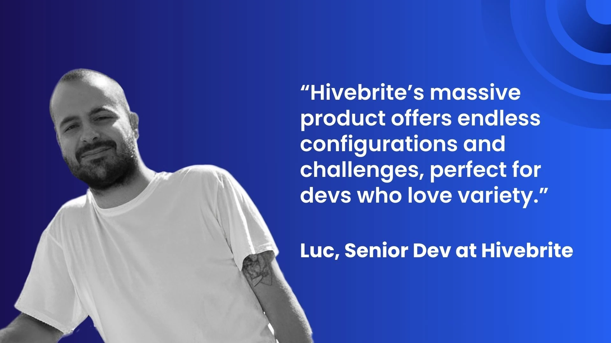
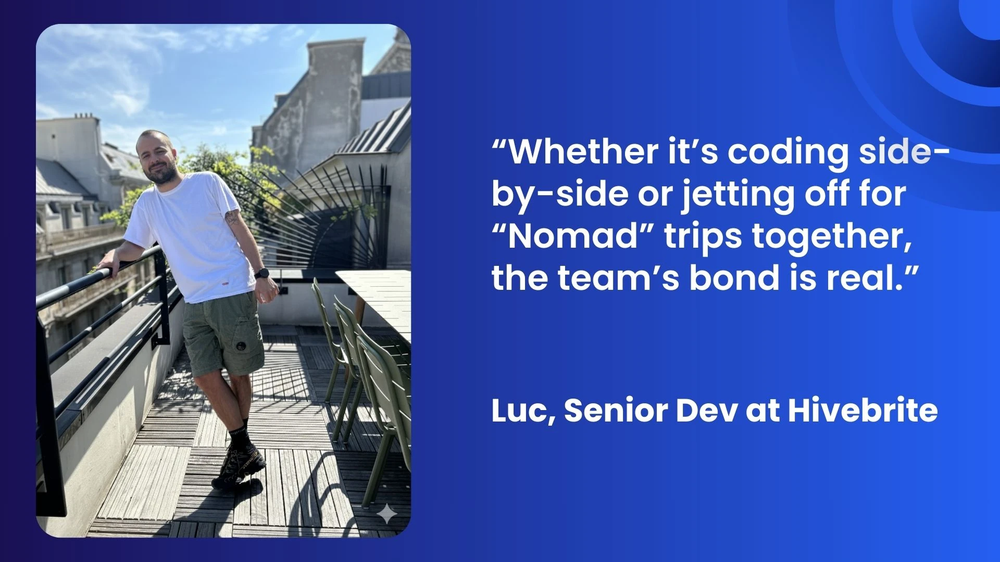
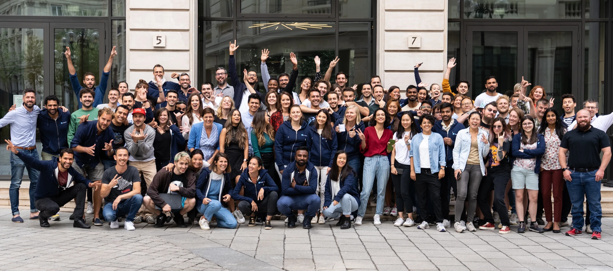

+++
author = "rubenmarois"
title = "Code, Connect, and Grow: Luc’s Story as a Senior Dev at Hivebrite"
date = "2025-09-16"
description = "Code, Connect, and Grow: Luc’s Story as a Senior Dev at Hivebrite"
tags = [
    "culture", "people"
]
categories = [
    "tech"
]
canonicalUrl = "https://hivebrite.io/blog/lucs-senior-dev-at-hivebrite/"
thumbnail = "/img/thumbs/hivebrite.webp"
#featureImage = "hivebrite.webp"
#featureImageAlt = "Hivebrite's engineering team!"
+++

> This article was originally published on the [Hivebrite blog](https://hivebrite.io/blog/lucs-senior-dev-at-hivebrite/).

## Introduction

In the bustling tech scene of Paris, you'll find Luc writing code and crafting solutions at Hivebrite's vibrant office. As a Senior Developer in the Evolution Tribe, his four-year journey showcases what's possible when talent meets opportunity. Between coding sessions, you might spot him enjoying the sunshine on the office terrace or brainstorming with colleagues. His story shows how passion, dedication, and the **right environment can shape an exceptional tech career**.

## From Junior to Senior: Luc’s Growth Journey

When Luc joined Hivebrite, he brought basic programming knowledge and experience from his work with an NGO. His strongest asset wasn't technical expertise but rather his hunger to learn and create. "I was super motivated and full of ideas, but I needed guidance." he remembers. The Evolution Tribe provided exactly what he needed - **an environment where questions sparked discussions and every challenge became a learning opportunity**.

Working alongside experienced developers, Luc built his technical expertise step by step. He mastered Go programming, embraced software craftsmanship, and learned to navigate complex product engineering processes. **Hivebrite supported his development through structured learning resources and dedicated time for personal growth**.

Today, Luc tackles various technical challenges, including innovative AI projects with the User Journey Tribe. His next chapter involves joining the Developer Efficiency and Architecture squad, where he'll focus on core technical challenges that match his interests. **This progression shows how Hivebrite enables developers to shape their career paths according to their passions**.

## Why Hivebrite Feels Like Home

The Hivebrite office stands out as more than a workplace - it's where creativity meets community. Team bonding happens naturally through afterwork gatherings and planned activities. Luc recalls a memorable hackathon focused on enhancing the app's global search capabilities: "We were munching pizza, geeking out, and ended up in third place, it was fun!"

The tech team’s vibe is like a family. “Everyone’s close, and we genuinely enjoy hanging out,”**Whether it’s coding side-by-side or jetting off for “Nomad” trips together, the team’s bond is real**.

A fun anecdote? These bonds extend beyond regular office hours. At a recent offsite, the Larzac squad (SRE team) created their own pop-up “557” store, named after their bungalow number. With handmade menus, playful themes, and plenty of good humor, the initiative became a highlight of the trip, showcasing the team’s creativity and sense of fun.

## Making an Impact Beyond Code

Luc's role goes far beyond writing lines of code. As a mentor, he's a go-to person for storage, dev environment setup, and key app modules. He's passionate about sharing knowledge and initiating new ideas and solutions.

A proud moment? To name just one, it was two years ago, when he proposed a simpler approach to full-text search. Finding Elasticsearch too complex for certain use cases, he took the initiative to introduce pg_tsvector. This decision was a personal turning point, marking the beginning of his self-confidence and a new willingness to take ownership. "I evangelized the approach, and now it's being used more and more in the app." he says.

His work continues to shape Hivebrite's technical direction. Recently, he's focused on AI-oriented projects, developing Python services that enhance the platform's capabilities. His efforts show how **individual developers can influence technical strategy while staying current with emerging technologies**.

## Advice for Future Hivebriters

Thinking of applying? Luc’s got some tips: “Bring a solid technical foundation - OOP knowledge is key - and a love for getting your hands dirty. Be proactive, propose ideas, and thrive on autonomy.” **Hivebrite’s massive product offers endless configurations and challenges, perfect for devs who love variety**. With some legacy code and new programming languages on the horizon (AI’s shaking things up!), you’ll need to be adaptable and eager to experiment, which makes the job very exciting.

## Fun Facts and Team Rituals

A quirky tidbit about Luc? His coworker and friend Franck runs a Slack channel where he posts Luc’s “outfit of the day” like a true influencer. “One night, our CEO liked six of my posts at 1am., I was shook!” he chuckles. His favorite team tradition? Friday evenings on the office terrace, sipping drinks with colleagues. “It’s cozy, welcoming, and brings us closer,” he says.

## Why Join Hivebrite?

Luc’s story sums it up: Hivebrite trusted him from day one, and he’s paid it back with growth and impact. From junior to senior, he’s tackled every step, learned tons, and now mentors others. “**This place lets you shine**.” he says. With a modern stack, meaningful projects, and a team that feels like family, Hivebrite is where tech dreams come alive. Ready to code, connect, and grow? A story at Hivebrite awaits! [View open positions](https://www.welcometothejungle.com/en/companies/hivebrite/jobs).
