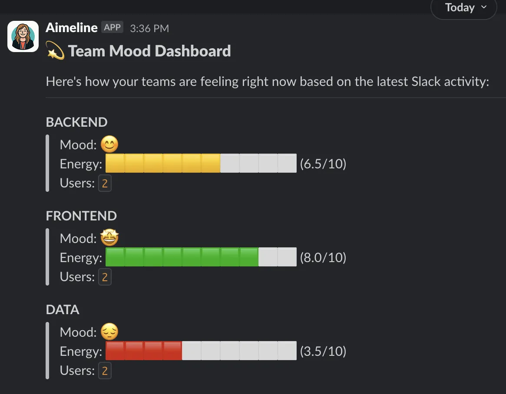

+++
author = "christinehuang"
title = "Hackathon Retrospective: Our Experience at the Dust x Qdrant Event"
date = "2025-05-16"
description = "Hackathon Retrospective: Our Experience at the Dust x Qdrant Event"
tags = [
    "hackathon", "dust", "ai",
]
categories = [
    "tech"
]
thumbnail = "/img/thumbs/hivebrite.webp"
featureImage = "images/qonto-headquarter.webp"
featureImageAlt = "Dust x Hackathon kickoff"
+++

## 🧭 Context

On April 11th, a small Hivebrite team participated in an external hackathon hosted at [Qonto](https://qonto.com/)’s headquarters in Paris. The event was organized by [Dust](https://dust.tt/) and [Qdrant](https://qdrant.tech/) and aimed to explore innovative use cases for generative AI agents.
This one-day hackathon brought together tech enthusiasts, developers, designers, and AI-curious minds to create useful AI agents addressing specific personas or use cases, like sales or customer support. While Dust provided access to powerful models (including OpenAI, Anthropic, DeepSeek, and Mistral), participants were also free to use their own APIs or platforms.

## 👥 Our Team

Our Hivebrite group included people from different roles and backgrounds, which enriched our collaboration.

- **Pierre** was incredibly enthusiastic, actively promoting the event beforehand and motivating others to join.
- **Sandy**, a talented and passionate front-end developer, brought creativity and attention to detail.
- **David**, a versatile SRE with a wide range of talents handled infrastructure and data storage challenges.
- **Slim**, a backend developer with a strong ability to pitch and communicate technical ideas, led the agent’s implementation.
- **Cyril**, an exceptional backend developer with a talent for making complex concepts accessible, played a key role in guiding the team through technical challenges.
- **Christine**, I’m a front-end developer, curious and eager to learn.

While I sometimes felt out of my comfort zone, this experience was a great opportunity for me to grow and contribute to the team.

## 🚀 Kick-off & Hackathon Flow

Once we arrived at Qonto, the welcome was warm: breakfast was ready, and the organizers kicked off the day around 10 a.m. with a presentation of the event goals and expectations. The challenge was to build an AI agent that served a real purpose, ideally something impactful or innovative. The only constraint: we had to submit a presentation video by 4 p.m., and only six groups would be selected to present their work.
A short workshop followed, especially useful for participants who had never used Dust. We covered the basics of creating an AI agent, setting up workflows, and integrating with Slack. We encountered a small hiccup: nobody had admin access to the shared workspace, so Dust organizers had to grant permissions manually.
Once the setup was complete, it was time to brainstorm. We tossed around a few ideas and ultimately chose something that felt both meaningful and achievable: an AI agent that could analyze public Slack channels to detect team mood. The goal was to help managers detect friction or frustration early, and receive alerts accordingly.

## 🧩 Our project

With our idea locked in, we distributed tasks. Slim took the lead on building the Dust agent. Pierre and Cyril developed the middleware app that would communicate between the AI agent and our database. David figured out how the data would be stored and managed. Sandy and I focused on crafting the mocked data and designing how managers would interact with the agent.
We chose Slack as our user interface. A manager could ask, for instance, "How's Team A this week?" and the AI agent would return a summary based on recent messages. We even managed to connect the event Slack to our Dust agent in near real time.

## 🧠 Challenges Faced

One of the key challenges was transforming an abstract idea into a working prototype in just a few hours. We assumed the Dust AI agent would be able to send results directly to our Slack, but quickly realized we needed a custom app in between. This middleware component turned out to be more complex than we had initially thought.
We also underestimated how quickly the day would fly by. Though the hackathon officially lasted a full day, the need to submit our video presentation early meant we had very limited time to design, build, and polish our project. From the first brainstorming session to the final bits of code, everything had to move fast.
In the end, we didn't get everything fully up and running, but we were able to send mock data to Slack, which gave us a clear sense of how our idea could work in practice. We were very close to pulling in real data directly from the Dust AI agent, and with a little more time, we would have been able to complete the integration.

## 💡 What We Learned

This experience highlighted how crucial time management and adaptability are during a hackathon. It's better to choose tools you're already familiar with, even if they weren't suggested by the organizers and to test technical setups in advance to avoid surprises.
In retrospect, we might have opted for a more flexible user interface than Slack, which felt limited in terms of interaction and display. And when it comes to presenting, we realized perfection isn't the goal; it's more important to show something that works and clearly explain the thinking behind it.
Next time, we'd make sure to test the tools beforehand, define architecture components more clearly, and stay open to pivoting quickly if something isn't working.

## 🤝 Networking and Inspiration

Aside from building a prototype, this hackathon was an excellent chance to connect with others and share ideas. We spoke with Stephan, an SRE from Qonto, who offered valuable technical insights. It was also inspiring to learn that at Qonto, every tech person is empowered to use AI tools independently, there's no centralized AI team, just distributed innovation. This mindset really resonated with us at Hivebrite.
Meeting people from other companies and learning about their challenges and solutions was both enlightening and inspiring.

## 🎉 Final Thoughts

This was my very first professional hackathon, and at first, I thought it would be inaccessible and that I wouldn’t understand what was going on. However, my curiosity led me to join, and I’m glad I did. Working on something new outside of our usual projects, alongside colleagues I don’t often work with, was a deeply rewarding experience. I focused on understanding how everything fit together, learning the tools as I went, and contributing wherever I could. found a supportive, collaborative team environment where experimentation and learning were prioritized over perfection. 
I'm grateful that Hivebrite made this experience possible, it's inspiring to be part of a company with a culture that empowers collaboration and innovation.
By the end of the event, I felt more confident, connected, and excited about the possibilities of AI. I hope this encourages others to take part in future hackathons and that we see more events like this one, where we can all learn, share, and grow together.
