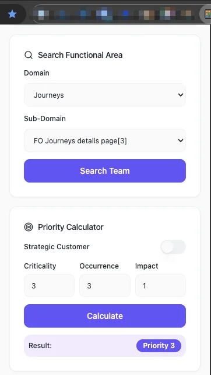
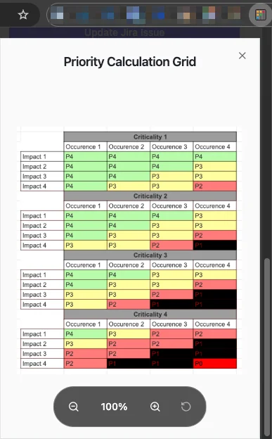

+++
author = "marclederoff"
title = "How Hivebrite Makes Quality Visible at Scale (Part 1)"
date = "2026-01-06"
description = "How Hivebrite Makes Quality Visible at Scale [Part 1]"
tags = [
    "QA", "testing", "automation", "quality assurance", "engineering practices", "risk management"
]
categories = [
    "tech"
]
canonicalUrl = "https://hivebrite.io/blog/how-hivebrite-makes-quality-visible-at-scale-1/"
thumbnail = "/img/thumbs/hivebrite.webp"
#featureImage = "hivebrite.webp"
#featureImageAlt = "Hivebrite's engineering team!"
+++

## Introduction

As SaaS products scale, quality problems rarely come from one “big” failure. They come from the accumulation of small risks: more teams shipping in parallel, more configuration paths, more customer contexts, and more surface area for edge cases to hide.

Hivebrite reached that stage.

At that point, "QA at the end" stops working — not because QA isn't good enough, but because the system isn't designed for scale. The only sustainable option is to make quality **shared**, **measurable**, and **visible** across Product, Engineering, QA, and Support.

That’s what we built: a way to align early on what matters, prioritise risk consistently, and scale automation without losing trust in it.

This post explains the practical mechanisms behind that approach: how we plan, how we prioritise, and how we use automation and quality gates to move fast with confidence.

## Our view on quality

At Hivebrite, **QA is not just a gate - it's a partner in delivery**.

Quality isn’t something added at the end of a cycle, nor something owned by a single role. It’s a continuous, collaborative effort that starts during discovery and continues through delivery and beyond.

Our role in QA is to help teams:

- Understand risk early
- Clarify expectations
- Build confidence that what we ship behaves as intended for users

This mindset is formalised in our QA Manifesto.

## Our QA Manifesto

Our manifesto isn’t a checklist. It’s a set of principles that guide everyday decisions across squads.

- **Quality is shared** — QA enables quality; squads own it together.
- **Testing starts with understanding** — a story isn't ready until risks and scope are clear.
- **We plan before we test** — preparation drives speed.
- **Prevention beats detection** — better questions early mean fewer late surprises.
- **Automation serves insight** — confidence over vanity metrics.
- **Clarity over volume** — evidence should support decisions.
- **Consistency without rigidity** — standardise where it helps, adapt where it matters.
- **Continuous learning** — every release is a feedback loop.

## Shared rituals: refinement and Three Amigos

Early alignment is critical to building quality in a scalable way. At Hivebrite, we rely on **two complementary rituals** to ensure requirements are well understood before development begins: **backlog refinement** and **Three Amigos**.

### Refinement: building shared understanding over time

Refinement sessions are part of our continuous planning process. They allow teams to progressively clarify requirements as product understanding evolves.

Refinement helps us:

- Improve requirements incrementally as new information emerges
- Break down work into clearer, more estimable User Stories
- Reduce ambiguity through well-defined acceptance criteria
- Foster collaboration and shared understanding across the squad

This ongoing refinement ensures the backlog remains actionable and aligned with product goals.

### Three Amigos: focused alignment for complex or risky work

While refinement supports continuous clarity, **Three Amigos meetings are used more selectively**.

A Three Amigos brings together:

- The PO/PM
- The QA Analyst in the squad
- The Tech Lead (or a developer)

Its purpose is to **deep-dive on User Stories that carry higher complexity or risk**, particularly when:

- Non-functional requirements are critical (performance, accessibility, security)
- Technical implementation is complex or has broader impact
- User flows or migrations need careful review
- Rollback or data integrity scenarios must be anticipated

By combining product, technical, and quality perspectives early, potential issues can be identified before implementation begins: from edge cases and flow inconsistencies to performance, security or accessibility concerns.

### How the two work together

Refinement and Three Amigos are **not exclusive** — they reinforce each other.

Refinement often surfaces changes or uncertainties that signal the need for a focused Three Amigos discussion. In those cases, a smaller group can quickly align on implications, validate assumptions, and shape a clear QA and technical approach.

Just as importantly, **not every story requires a Three Amigos**. We deliberately reserve it for work where early collaboration delivers the most value.

This balance allows teams to move fast on straightforward changes while investing deeper thinking where risk and complexity demand it.

## From shared understanding to a clear QA plan

Each feature is supported by a **lightweight but structured QA plan**.

The plan answers a few essential questions:

- What is in scope for this release?
- Which functional areas are most critical?
- Where are the main risks?
- What testing is required?
- What is intentionally deferred?

Reviewed with Product and Engineering before execution, this plan makes expectations explicit and keeps QA a **decision enabler**, not a late-stage blocker.

For significant changes, QA Analysts share a short overview of the plan with the broader team. This helps surface cross-squad integration risks, anticipate test documentation needs, and reduce both silo effects and regression risk.

## Risk-based bug prioritisation

As our product and customer base scaled, relying on intuition or urgency alone to prioritise bugs was no longer sustainable. Different teams naturally perceive impact differently, which can lead to inconsistent decisions and unnecessary friction.

To address this, we rely on a **simple and transparent risk-based prioritisation system**, internally referred to as the *Bug Prioritisation Abacus* (Chrome extension internally developed).

Each reported issue is evaluated along three complementary dimensions going from 1 (lowest) to 4 (highest):

- **Functional criticality** — how central the affected area is to the product and customer workflows
- **User impact** — the severity of the effect on users when the issue occurs
- **Occurrence** — how frequently the issue is observed in real usage

By combining these perspectives, teams can assess bugs based on **risk and customer impact**, rather than individual perception or short-term pressure.

This notion of **functional criticality** is shared beyond bug triage. The same mapping is used within our test management system to tag test cases by criticality, helping teams quickly identify which tests protect core user journeys and which cover lower-risk areas.

In practice, this approach:

- Creates a shared language across Product, Engineering, QA, and Support
- Reduces subjective debates during triage
- Aligns test coverage with real product risk
- Keeps attention focused on the problems that matter most to users

Most importantly, it enables more predictable planning and faster decision-making, while maintaining a consistent level of quality across squads. Together, these practices ensure risk is identified, prioritised, and addressed consistently.

## Making automation visible and trustworthy

Automation is a key part of how we scale quality, and we treat it as a **confidence mechanism**.

As of early 2026, our test suite includes **3,644 active tests**, with a deliberately balanced distribution:

- **1,844 manual tests (≈51%)**
- **1,558 automated tests (≈43%)**
- **242 tests (≈7%)** identified as automation candidates

This balance is intentional. Manual testing remains essential for exploration and early-stage features, while automation is focused on stable, high-value user paths.

### Quality gates over raw coverage

Not all automated tests are equal.

We rely on **quality gates** to signal trust:

- Some tests are robust enough to act as **release gates**
- Others qualify as **deployment or CI gates**
- New tests must first prove stability before being promoted

This prevents false confidence and ensures automation accelerates delivery rather than slowing it down.

### Stability as a first-class metric

Automation health is treated as a quality signal.

Across our automated suite, instability is deliberately kept extremely low. Flaky or muted tests are addressed quickly to preserve trust. When automation fails, teams can act with confidence rather than doubt.

### Automation as a roadmap

Automation decisions at Hivebrite are guided by **risk and value**, not volume.

Rather than automating everything by default, manual tests are continuously evaluated using a **structured decision matrix** to determine which scenarios are:

- **High-value automation candidates**, where automation brings clear and lasting benefits
- **Better left manual**, typically due to volatility or low long-term return
- **Deferred**, pending greater product or functional stabilisation

Each scenario is reviewed against a consistent set of criteria designed to maximise impact and sustainability, including:

- **Frequency of execution** — scenarios executed often benefit most from automation
- **Repetitiveness** — time-consuming, repetitive tests are strong candidates
- **Business criticality** — core user journeys and high-risk flows are prioritised
- **Feature stability** — automation is favoured once behaviour is stable
- **Data setup complexity** — scenarios with simple, reusable data are easier to maintain
- **Return on investment** — long-term maintenance cost versus execution savings
- **Technical feasibility** — suitability for existing automation frameworks

By evaluating tests through this lens, automation becomes a **deliberate, evolving roadmap** rather than a growing backlog. Effort is focused where it protects critical user journeys, reinforces confidence in releases, and remains sustainable over time.

## Why this matters for customers

All of these practices — early QA involvement, risk-based prioritisation, structured planning, and intentional automation — exist for one reason: **customer trust**.

In practice, this approach means:

- **Fewer regressions in production**, because critical user journeys are explicitly identified, prioritised, and protected by targeted testing and reliable automation
- **More predictable releases**, thanks to clear quality gates, explicit risk assessment, and shared understanding of what “done” means
- **Faster iteration without repeating mistakes**, as incidents and bugs are systematically turned into durable test coverage rather than one-off fixes
- **Stronger confidence in critical paths**, supported by objective prioritisation, stable automation, and continuous validation of what matters most to users

By making quality visible and intentional at every stage, we reduce surprises for customers and enable teams to move fast with confidence.

## What’s next

As development teams increasingly adopt AI-assisted workflows, QA must evolve alongside them to avoid becoming a bottleneck in the software development life cycle.

At Hivebrite, we've started integrating AI tools into our QA workflows to accelerate analysis, documentation, test generation, and decision-making — not to replace human judgment, but to enhance it. We're leveraging the same tools developers use daily: [Cursor](https://cursor.com) with custom rules and prompts, [Claude Code](https://claude.com/product/claude-code), and [Dust](https://dust.tt) assistants.

In a follow-up post, we’ll share how we use internal AI assistants and developer-facing AI tools to:

- Close the gap between QA and development speed
- Turn bugs, incidents, and product knowledge into actionable test assets
- Keep quality scalable without sacrificing rigor

Stay tuned.

## Closing thoughts

Quality is not a phase, a checklist, or a role. It’s a shared discipline that evolves with the product and the organisation.

At Hivebrite, our goal is simple: **move fast without breaking things twice.**