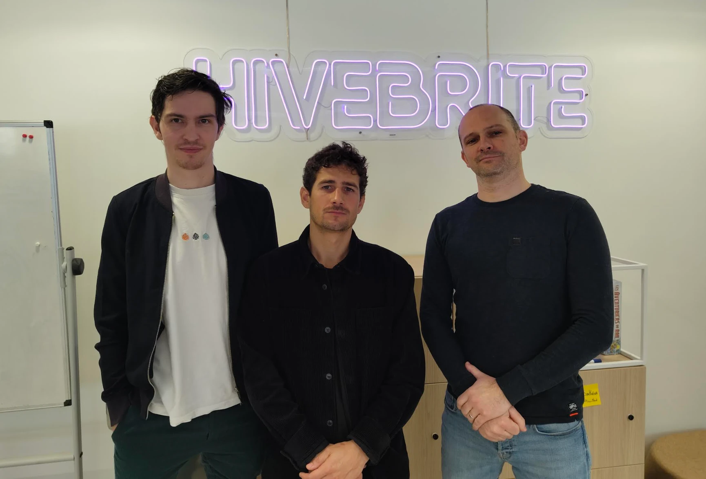

+++
author = "David Calvert"
title = "Hivehack 2025"
date = "2024-12-18"
description = "Hivehack 2025: Hackathon results"
tags = [
    "hackathon",
]
categories = [
    "tech"
]
featureImage = "dummy.webp"
featureImageAlt = 'Dummy banner'
+++

## Introduction

Hivebrite hosted an exciting event in 2025: Hivehack 2025, a hackathon that brought together innovative minds to tackle challenges at the intersection of AI and security. Participants from diverse backgrounds collaborated intensively over the course of the event, leveraging cutting-edge technologies to develop solutions that address pressing security concerns in the digital age. This hackathon not only showcased the potential of AI in enhancing security measures but also fostered a spirit of collaboration and creativity among the participants.

## Winners

Team 557 impressed everyone yet again with their outstanding performance at Hivehack 2025, proving that their reputation as top-tier engineers is well-deserved with their first-place victory. This powerhouse team showcased their mastery of cutting-edge technologies, expertly wielding tools like Bash, Python, and Make to craft robust unit tests and end-to-end tests for Terraflow. But they didn't stop there! Adding another feather to their cap, Team 557 also managed to launch the [engineering.hivebrite.io](https://engineering.hivebrite.io/) blog, cementing their status as both technical wizards and creative innovators. It's no surprise that they stole the show with their remarkable achievements!

